# Architecture Diagrams - PyShorthand 0.9.0-RC1

**Date:** 2025-11-24
**Diagram Notation:** C4 Model + Mermaid
**Audience:** Technical stakeholders, architects, developers
**Version:** 0.9.0-RC1

## Overview

This document provides multi-level architectural views of the PyShorthand system using the C4 model (Context, Container, Component). PyShorthand is a sophisticated intermediate representation (IR) system for Python codebases, designed to provide high-density compression optimized for LLM consumption with progressive disclosure.

**Key Architectural Characteristics:**
- **Zero-dependency core** enabling embeddability and portability
- **Immutable AST design** for thread-safety and functional programming
- **Progressive disclosure** system (93% token savings, 90% accuracy)
- **Clean 3-layer architecture** with perfect dependency direction

---

## Level 1: System Context Diagram

### Purpose
Shows how PyShorthand fits into the broader ecosystem and who/what interacts with it.

### Diagram

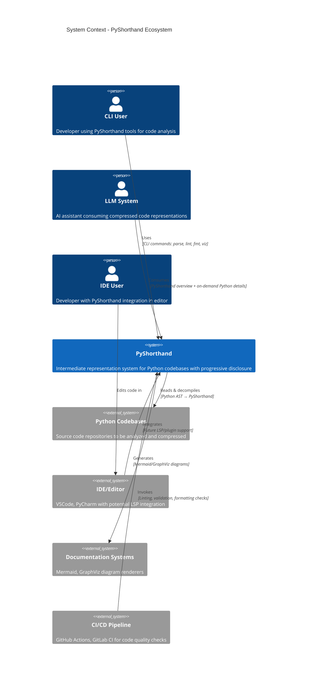

### Key Relationships

**User Interactions:**
- **CLI User → PyShorthand:** Direct command-line usage for parsing, linting, formatting, visualization, and decompilation
- **LLM System → PyShorthand:** Two-tier progressive disclosure pattern - starts with compressed PyShorthand, requests full Python implementations on-demand
- **IDE User → IDE → PyShorthand:** Future integration path for real-time linting and formatting (LSP planned)

**System Interactions:**
- **PyShorthand → Python Codebases:** Bidirectional - reads Python for decompilation, can validate and analyze existing .pys files
- **PyShorthand → Documentation Systems:** Generates Mermaid and GraphViz diagrams for architectural documentation
- **CI/CD → PyShorthand:** Automated quality gates using lint and format commands

### Context Boundaries

**PyShorthand System Boundary:**
- Core parsing and validation (zero dependencies)
- Code transformation (Python ↔ PyShorthand)
- Analysis tools (context packs, execution flow)
- Progressive disclosure API for LLM integration

**External Systems:**
- Python repositories (input)
- Visualization renderers (output)
- Development tools (integration)

---

## Level 2: Container Diagram

### Purpose
Shows the major deployable/executable components within PyShorthand and their communication patterns.

### Diagram

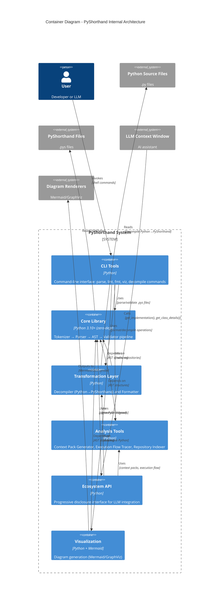

### Container Descriptions

#### **CLI Tools**
- **Technology:** Python 3.10+, argparse, optional (click, rich)
- **Responsibilities:** User-facing command-line interface
- **Commands:** parse, lint, fmt, viz, py2short, pyshort-index
- **Deployment:** Installed via pip/uv as console scripts
- **Dependencies:** All other containers
- **Scale:** Single-process, invoked per-command

#### **Core Library**
- **Technology:** Python 3.10+ stdlib only (zero external dependencies)
- **Responsibilities:**
  - Lexical analysis (Tokenizer - 547 LOC)
  - Syntax analysis (Parser - 1,252 LOC)
  - AST data structures (727 LOC)
  - Semantic validation (Validator - 631 LOC)
  - Symbol mappings (Symbols - 230 LOC)
- **Key Quality:** 100% type hint coverage, immutable frozen dataclasses
- **Deployment:** Embeddable library, portable across environments
- **Performance:** O(n) parsing, single-pass tokenization

#### **Transformation Layer**
- **Technology:** Python 3.10+ with Python `ast` module
- **Responsibilities:**
  - Decompiler (Python AST → PyShorthand - 1,142 LOC)
  - Formatter (PyShorthand pretty-printing - 417 LOC)
  - Type inference and tag extraction
- **Key Features:** Framework detection (Pydantic, FastAPI, PyTorch), aggressive type inference
- **Deployment:** Library modules invoked by CLI or Ecosystem

#### **Analysis Tools**
- **Technology:** Python 3.10+ with optional networkx, graphviz
- **Responsibilities:**
  - Context Pack Generator (F0/F1/F2 dependency layers)
  - Execution Flow Tracer (runtime path analysis)
  - Repository Indexer (cross-file analysis)
- **Key Features:** Filtering APIs, Mermaid export, dependency graphs
- **Deployment:** Library modules for programmatic use

#### **Ecosystem API**
- **Technology:** Python 3.10+ facade over all layers
- **Responsibilities:** Progressive disclosure for LLM integration
- **Methods:** `get_implementation()`, `get_class_details()`, `search_usage()`, `get_context_pack()`, `trace_execution()`
- **Key Innovation:** 93% token savings vs full code, 90% accuracy (empirical)
- **Deployment:** Library facade, caching enabled

#### **Visualization**
- **Technology:** Python 3.10+ generating Mermaid/GraphViz syntax
- **Responsibilities:** Generate diagrams from AST
- **Formats:** Flowcharts, class diagrams, dependency graphs
- **Key Features:** Risk-based coloring, subgraph organization
- **Deployment:** Invoked by CLI or integrated in documentation

### Container Communication Patterns

**Dependency Flow:**
```
CLI ─────────────┐
                 ↓
Ecosystem ───────┼────→ Core (Foundation)
                 │        ↑
Transform ───────┤        │
                 │        │
Analysis ────────┤        │
                 │        │
Visualization ───┘        │
                          │
All depend on Core ───────┘
```

**Data Flow:**
1. **Parse Flow:** User → CLI → Core (Tokenizer → Parser → AST) → JSON output
2. **Decompile Flow:** User → CLI → Transform (Decompiler reads Python AST) → Core (generates PyShorthand AST) → output
3. **Progressive Disclosure Flow:** LLM → Ecosystem → Context Pack (lightweight) → on-demand → Transform (full Python)

---

## Level 3: Component Diagram - Core Library

### Purpose
Detailed view of the Core Library components and their interactions (the zero-dependency foundation).

### Diagram

```mermaid
flowchart TB
    subgraph core["Core Library Container (Zero Dependencies)"]
        direction TB

        symbols["<b>Symbols</b><br/>231 LOC<br/>━━━━━━━━━<br/>Unicode↔ASCII mappings<br/>VALID_TYPES, VALID_TAGS<br/>Constants & utilities"]

        tokenizer["<b>Tokenizer</b><br/>547 LOC<br/>━━━━━━━━━<br/>Lexical analysis<br/>60+ token types<br/>Unicode/ASCII support"]

        ast["<b>AST Nodes</b><br/>727 LOC<br/>━━━━━━━━━<br/>Frozen dataclasses<br/>PyShortAST, Entity<br/>Class, Function, StateVar<br/>Immutable design"]

        parser["<b>Parser</b><br/>1,253 LOC<br/>━━━━━━━━━<br/>Recursive descent<br/>Entity, type, expression parsing<br/>Error recovery"]

        validator["<b>Validator</b><br/>632 LOC<br/>━━━━━━━━━<br/>14 validation rules<br/>Metadata, tags, safety checks<br/>Suggestion engine"]

        errors["<b>Enhanced Errors</b><br/>102 LOC<br/>━━━━━━━━━<br/>Diagnostic dataclass<br/>Severity levels<br/>Did-you-mean suggestions"]

        config["<b>Config</b><br/>181 LOC<br/>━━━━━━━━━<br/>.pyshortrc loader<br/>Format preferences<br/>Validation strictness"]
    end

    %% Dependencies
    tokenizer -->|List[Token]| parser
    parser -->|uses| symbols
    parser -->|constructs| ast
    parser -->|raises| errors

    validator -->|analyzes| ast
    validator -->|validates against| symbols
    validator -->|generates| errors

    ast -.->|validates tags with| symbols
    errors -.->|suggests from| symbols

    config -.->|configures| validator
    config -.->|configures format| parser

    %% Styling
    style symbols fill:#e1f5e1,stroke:#2d5016,stroke-width:2px
    style tokenizer fill:#e1f5e1,stroke:#2d5016,stroke-width:2px
    style ast fill:#ffe1e1,stroke:#8b0000,stroke-width:2px
    style parser fill:#e1f5e1,stroke:#2d5016,stroke-width:2px
    style validator fill:#e1f5e1,stroke:#2d5016,stroke-width:2px
    style errors fill:#fff3cd,stroke:#856404,stroke-width:2px
    style config fill:#d1ecf1,stroke:#0c5460,stroke-width:2px
```

### Component Descriptions

#### **Symbols (Foundation)**
- **Responsibility:** Centralized symbol definitions and conversion utilities
- **Key Exports:**
  - `UNICODE_TO_ASCII`, `ASCII_TO_UNICODE` mappings
  - `VALID_TAG_BASES`, `VALID_TYPES`, `VALID_LOCATIONS`, `HTTP_METHODS`
  - `to_ascii()`, `to_unicode()` converters
  - `is_complexity_tag()`, `parse_http_route()` validators
- **Dependencies:** None (pure data + stdlib re)
- **Design Pattern:** Constant repository

#### **Tokenizer (Input Layer)**
- **Responsibility:** Convert raw text into token stream
- **Key Features:**
  - 60+ token types (keywords, operators, literals, delimiters)
  - Bidirectional Unicode/ASCII support (→ ↔ ->, ∈ ↔ IN)
  - Numeric range validation (i64: ±2^63, f64: ±3.4e38)
  - String escape sequences with multiline support
- **Output:** `List[Token]` with position tracking (line, column)
- **Dependencies:** None (stdlib only)
- **Performance:** O(n) single-pass lexing

#### **AST Nodes (Data Structures)**
- **Responsibility:** Define immutable representation of parsed code
- **Key Types:**
  - `PyShortAST` (root document with metadata, entities, diagnostics)
  - `Metadata`, `Entity`, `Class`, `Function`, `StateVar`, `Parameter`
  - `TypeSpec` (with generics, unions, references)
  - `Statement`, `Expression` (BinaryOp, FunctionCall, etc.)
  - `Tag` (operation, complexity, decorator, http_route)
  - `Diagnostic` (severity, location, suggestion)
- **Design:** Frozen dataclasses with `to_dict()` serialization
- **Benefits:** Thread-safe, hashable, GC-friendly, functional transformations
- **Dependencies:** Symbols (for tag validation)

#### **Parser (Syntax Analysis)**
- **Responsibility:** Build AST from token stream
- **Algorithm:** Recursive descent with lookahead
- **Key Methods:**
  - `parse()` - Top-level orchestration
  - `parse_class()` - Classes with generics, protocols, inheritance
  - `parse_function()` - Functions with contracts
  - `parse_type_spec()` - Complex types (unions, generics, references)
  - `parse_expression()` - Expressions with precedence
- **Error Handling:** Accumulates diagnostics, continues parsing (recovery)
- **Dependencies:** Tokenizer (input), AST Nodes (output), Symbols (constants)
- **Complexity:** 1,252 LOC, 29 methods (highest complexity in core)

#### **Validator (Semantic Analysis)**
- **Responsibility:** Enforce grammar and best practices
- **Architecture:** Rule-based system with 14 independent rules
- **Key Rules:**
  - Mandatory metadata (M:Name, Role)
  - Valid tag bases (Lin, Thresh, IO, NN, etc.)
  - Complexity notation (O(N), Θ(N²))
  - HTTP route syntax
  - Safety checks (!! requires [Risk:High])
  - Generic parameter validity
  - Inheritance validity
- **Output:** `List[Diagnostic]` with severity (ERROR, WARNING, INFO, HINT)
- **Features:** "Did you mean?" suggestions via Levenshtein distance
- **Dependencies:** AST Nodes (input), Symbols (validation sets), Enhanced Errors (diagnostics)

#### **Enhanced Errors (Quality of Life)**
- **Responsibility:** Rich error reporting
- **Features:**
  - `Diagnostic` dataclass with line, column, severity
  - Suggestion generation (`suggest_did_you_mean()`)
  - Error code system (E001-E399, W001-W399)
- **Dependencies:** Symbols (for suggestion sets)

#### **Config (Configuration)**
- **Responsibility:** Load and manage `.pyshortrc` configuration
- **Settings:**
  - Format preferences (indent, Unicode/ASCII, alignment)
  - Validation strictness
  - Linting rules enablement
- **Dependencies:** None (standalone)

### Data Flow Through Core

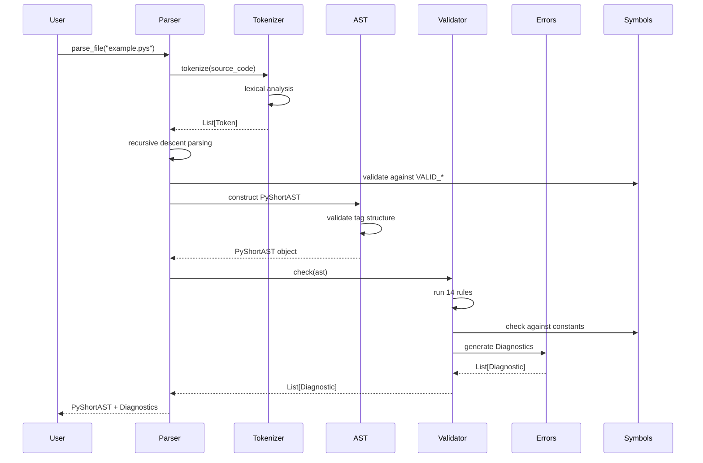

---

## Level 3: Component Diagram - Transformation Layer

### Purpose
Detailed view of Python ↔ PyShorthand transformation components.

### Diagram

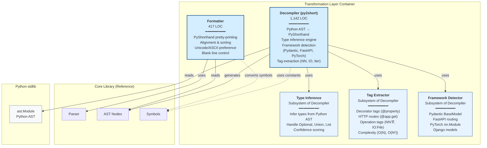

### Component Descriptions

#### **Decompiler (Python → PyShorthand)**
- **Responsibility:** Reverse-engineer Python AST into PyShorthand notation
- **Key Features:**
  - Class/function/module extraction from Python AST
  - Type annotation conversion (Python → PyShorthand types)
  - State variable extraction
  - Import dependency tracking
  - Aggressive vs conservative inference modes
  - Confidence score annotations
- **Algorithms:**
  - AST traversal with visitor pattern
  - Pattern matching for operations (loops → Iter, gradients → NN:∇)
  - Framework-specific heuristics
- **Output:** PyShorthand string or AST
- **Dependencies:** Python `ast` module, Symbols

#### **Type Inference (Subsystem)**
- **Responsibility:** Infer PyShorthand types from Python type hints and code patterns
- **Key Features:**
  - Handle `Optional[T]` → `T | None`
  - Convert `List[T]` → `[T]`
  - Map `Dict[K, V]` → `{K: V}`
  - Infer from assignments (aggressive mode)
  - Detect Pydantic field types
- **Output:** `TypeSpec` strings
- **Complexity:** 18 branches (high)

#### **Tag Extractor (Subsystem)**
- **Responsibility:** Detect and convert Python decorators/patterns to PyShorthand tags
- **Mapping:**
  - `@property` → `[Prop]`
  - `@staticmethod` → `[Static]`
  - `@app.get("/path")` → `[GET:/path]`
  - `torch.backward()` → `[NN:∇]`
  - Loop nesting → `[O(N²)]`
- **Pattern Detection:** AST pattern matching for common idioms
- **Output:** Tag strings

#### **Framework Detector (Subsystem)**
- **Responsibility:** Identify and handle framework-specific patterns
- **Supported Frameworks:**
  - **Pydantic:** BaseModel fields, validators
  - **FastAPI:** Route decorators, dependencies
  - **PyTorch:** nn.Module, layers, ModuleDict
  - **Django:** Models, querysets
  - **Flask:** Route decorators
- **Impact:** Enables framework-aware tag generation

#### **Formatter (PyShorthand Pretty-Printing)**
- **Responsibility:** Format PyShorthand code with consistent style
- **Key Features:**
  - Configurable indentation (default 2 spaces)
  - Vertical alignment of type annotations
  - State variable sorting (by location: GPU → CPU → Disk)
  - Blank line control around entities
  - Unicode/ASCII preference toggle
  - Tag grouping (Decorators → Routes → Operations → Complexity)
- **Input:** PyShortAST
- **Output:** Formatted PyShorthand string
- **Dependencies:** Parser (for re-parsing), AST Nodes, Symbols

### Decompilation Flow

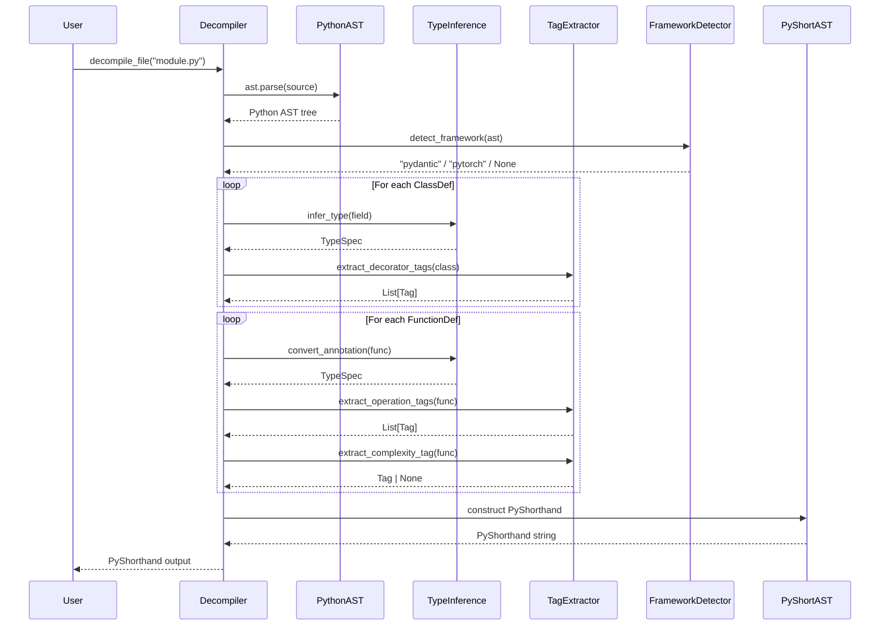

---

## Level 3: Component Diagram - Analysis Layer

### Purpose
Detailed view of analysis tools (Context Pack, Execution Flow, Indexer, Visualization).

### Diagram

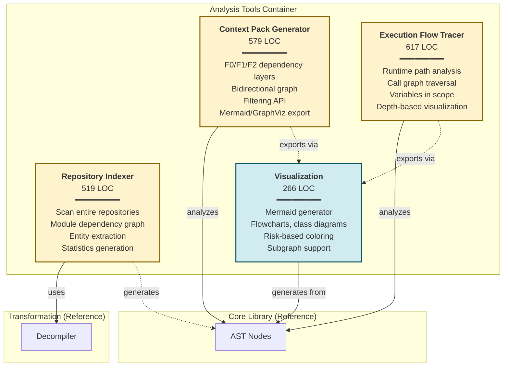

### Component Descriptions

#### **Context Pack Generator**
- **Responsibility:** Generate dependency-aware context for LLM consumption
- **Key Concepts:**
  - **F0 Layer:** Target entity (the focus)
  - **F1 Layer:** Direct dependencies (1-hop)
  - **F2 Layer:** Transitive dependencies (2-hop)
- **Key Features:**
  - Bidirectional graph (callers + callees)
  - Class peer detection (methods in same class)
  - State variable tracking across layers
  - Filtering API:
    - `filter_by_location(location)` - Filter by @GPU/@CPU
    - `filter_by_pattern(regex)` - Regex filtering
    - `filter_custom(predicate)` - Custom predicates
  - Export: Mermaid flowcharts, GraphViz DOT
- **Use Case:** Feed minimal context to LLM for targeted questions
- **Output:** `ContextPack` dataclass with F0/F1/F2 lists
- **Dependencies:** AST Nodes

#### **Execution Flow Tracer**
- **Responsibility:** Trace runtime call paths (vs static dependencies)
- **Key Features:**
  - DFS traversal with cycle detection
  - Depth tracking (max configurable, default 10)
  - Variables in scope per step
  - State variable access tracking
  - Call graph construction
  - Filtering API:
    - `filter_by_depth(max_depth)`
    - `filter_by_state_access(pattern)`
    - `filter_by_call_pattern(regex)`
  - Export: Mermaid flowcharts with depth-based colors, GraphViz
- **Use Case:** Understand actual execution paths at runtime
- **Output:** `ExecutionFlow` dataclass with steps
- **Dependencies:** AST Nodes

#### **Repository Indexer**
- **Responsibility:** Scan entire Python repositories for analysis
- **Key Features:**
  - Recursive directory scanning with exclusions (venv, __pycache__, .git)
  - Module path normalization (handles src/ directories)
  - Dependency graph construction (module-level)
  - Entity extraction (classes, functions) from each module
  - Statistics: LOC, entity counts, top modules
  - PyShorthand generation for each module
  - Mermaid dependency graph export
  - JSON serialization for caching
- **Use Case:** Repository-wide analysis, documentation generation
- **Output:** `RepositoryIndex` dataclass with module map, dependency graph, stats
- **Dependencies:** Decompiler (for Python→PyShorthand)

#### **Visualization**
- **Responsibility:** Generate Mermaid diagrams from AST
- **Diagram Types:**
  - **Flowchart:** Dataflow and dependencies
  - **Class Diagram:** UML-like structure with state/methods
  - **Graph:** Simple relationship graph
- **Key Features:**
  - Risk-based color coding (High=#ff6b6b, Med=#ffd93d, Low=#6bcf7f)
  - Subgraph support for module organization
  - Direction control (TB, LR, RL, BT)
  - Label truncation for readability
  - Method/state variable counts in labels
- **Configuration:** `MermaidConfig` with 7 options
- **Output:** Mermaid markdown syntax
- **Dependencies:** AST Nodes

### Context Pack Generation Flow

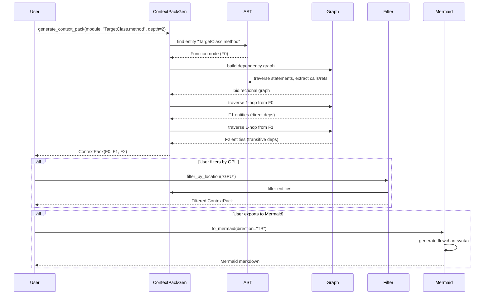

---

## Level 3: Component Diagram - Integration Layer

### Purpose
Detailed view of user-facing integration components (CLI, Ecosystem API).

### Diagram

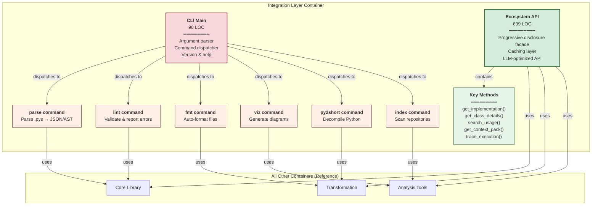

### Component Descriptions

#### **CLI Main (Command Dispatcher)**
- **Responsibility:** User-facing command-line interface
- **Technology:** argparse (stdlib) or optional click
- **Commands:**
  - `pyshort parse <file>` - Parse PyShorthand to JSON/AST
  - `pyshort lint <file>` - Validate and report errors
  - `pyshort fmt <file>` - Auto-format code
  - `pyshort viz <file>` - Generate diagrams
  - `py2short <file>` - Decompile Python to PyShorthand
  - `pyshort version` - Show version
- **Error Handling:** Exit codes (0=success, non-zero=error)
- **Dependencies:** All containers
- **Deployment:** Installed as console scripts via pip/uv

#### **Ecosystem API (Progressive Disclosure Facade)**
- **Responsibility:** Unified API for LLM integration with progressive disclosure pattern
- **Key Innovation:** Two-tier system
  - **Tier 1 (Cheap):** PyShorthand overview (894 tokens for nanoGPT)
  - **Tier 2 (On-demand):** Full Python implementation retrieval
- **Key Methods:**
  - `get_implementation(target)` → Full Python source for specific method
  - `get_class_details(class_name)` → Detailed class info with nested expansion
  - `search_usage(symbol)` → Find where symbol is used
  - `get_context_pack(target)` → F0/F1/F2 dependency layers
  - `trace_execution(entry_point)` → Call flow from entry point
  - `get_module_pyshorthand()` → Full module as PyShorthand
  - `get_class_pyshorthand(class_name)` → Single class as PyShorthand
- **Caching:** Implementation cache + AST cache for performance
- **Empirical Results:** 93% token savings, 90% accuracy vs full code
- **Dependencies:** All layers (facade pattern)
- **Use Case:** Feed PyShorthand to LLM, allow on-demand drill-down

### Progressive Disclosure Flow

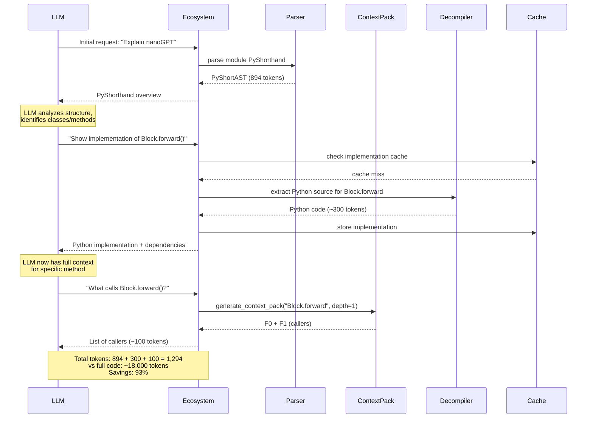

---

## Subsystem Dependency Graph

### Purpose
Shows compile-time dependencies between all 13 subsystems.

### Diagram

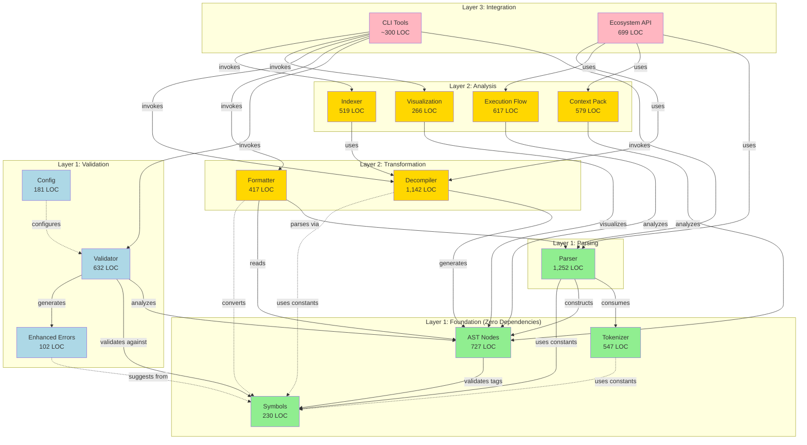

### Dependency Rules

**Layering Constraints:**
1. **Layer 1 (Foundation + Core):** No dependencies on Layers 2 or 3
2. **Layer 2 (Transformation + Analysis):** Can depend on Layer 1, not Layer 3
3. **Layer 3 (Integration):** Can depend on all layers (orchestration)

**Observed Compliance:**
- **Perfect adherence:** 0 upward dependencies detected
- **No circular dependencies:** All imports follow DAG structure
- **Zero-dependency core:** Tokenizer, AST Nodes, Symbols use stdlib only

**Rationale:**
- **Embeddability:** Core can be used without CLI or analysis tools
- **Portability:** Zero external dependencies in foundation enables easy integration
- **Testability:** Each layer can be tested independently
- **Maintainability:** Clear dependency direction prevents tangled code

---

## Data Flow Diagrams

### CLI Parse Flow (User Perspective)

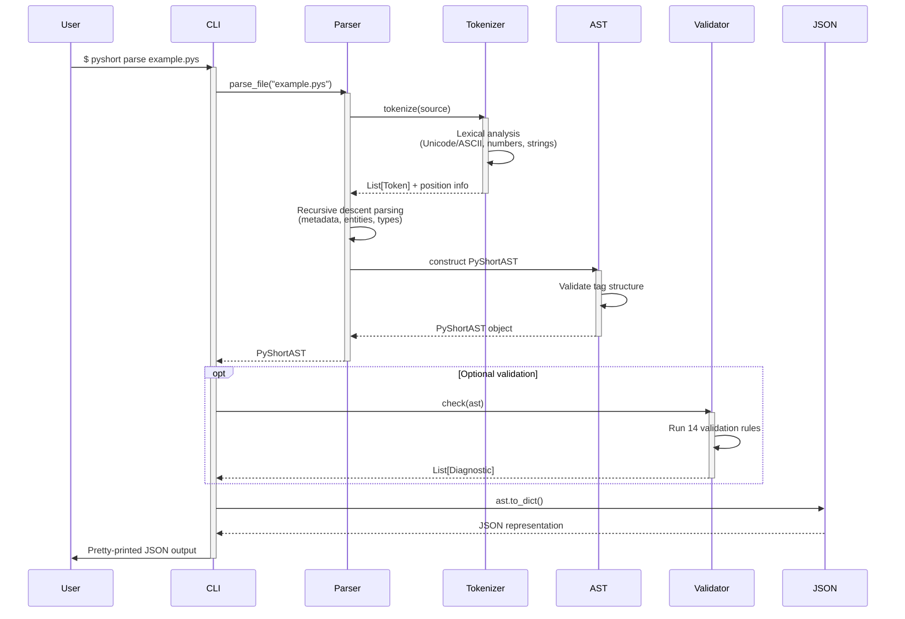

### Decompilation Flow (Python → PyShorthand)

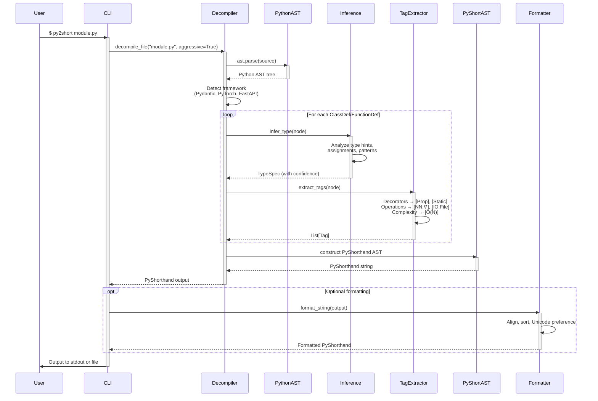

### Progressive Disclosure Workflow (LLM Integration)

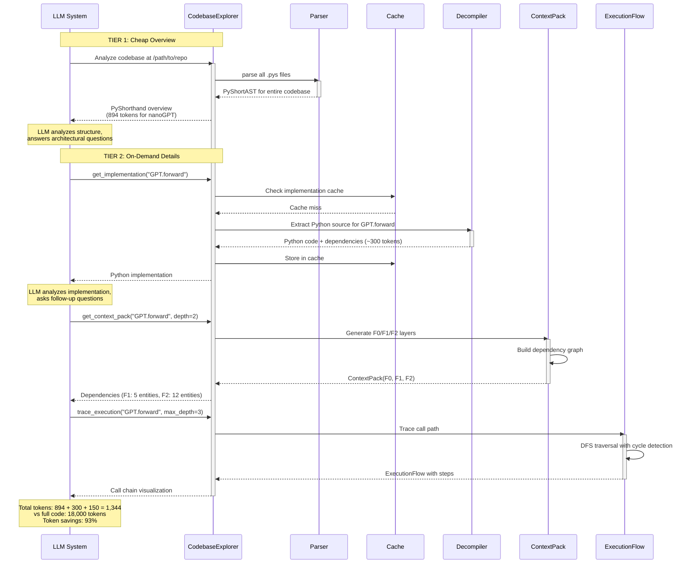

---

## Architecture Decision Records (Implicit)

### Key Architectural Decisions Observed

Based on code analysis, the following architectural decisions have been made (implicitly or explicitly):

#### 1. **Zero-Dependency Core**
- **Decision:** Core library (Tokenizer, Parser, AST, Validator, Symbols) uses Python stdlib only
- **Rationale:**
  - Embeddability in other projects without dependency conflicts
  - Portability across environments (minimal, containers, serverless)
  - Reduced security attack surface
  - Long-term stability (stdlib is stable)
- **Trade-offs:** Cannot use third-party parsing libraries (PLY, ANTLR) - must implement custom parser
- **Impact:** Excellent - Core is portable and reliable

#### 2. **Immutable AST with Frozen Dataclasses**
- **Decision:** All AST nodes are frozen dataclasses
- **Rationale:**
  - Thread-safety for parallel processing
  - Hashability enables caching and memoization
  - Functional programming style reduces bugs
  - GC-friendly (no reference cycles)
- **Trade-offs:** Cannot modify AST in-place - must create new instances
- **Impact:** Excellent - Enables caching, prevents accidental mutations

#### 3. **Rule-Based Validation Engine**
- **Decision:** Validator uses 14 independent `Rule` subclasses
- **Rationale:**
  - Extensibility without modifying core validator
  - Each rule testable in isolation
  - Easy to add custom rules for specific projects
  - Clear separation of concerns
- **Trade-offs:** Slight performance overhead from rule iteration
- **Impact:** Good - Extensible and maintainable

#### 4. **Progressive Disclosure (Two-Tier System)**
- **Decision:** PyShorthand overview (Tier 1) + on-demand Python details (Tier 2)
- **Rationale:**
  - 93% token savings for LLM context windows
  - Maintains 90% accuracy for code understanding tasks
  - Enables scaling to large codebases
  - LLM can request details only when needed
- **Trade-offs:** Requires LLM to make multiple API calls for full understanding
- **Impact:** Excellent - Empirically validated innovation

#### 5. **Unicode/ASCII Duality**
- **Decision:** Support both Unicode (→, ∈) and ASCII (->, IN) notation
- **Rationale:**
  - Platform compatibility (some terminals/editors don't render Unicode well)
  - Readability choice (users prefer different styles)
  - Lossless conversion (bidirectional mapping)
- **Trade-offs:** Tokenizer and formatter must handle both
- **Impact:** Good - Flexibility without complexity

#### 6. **Layered Architecture with Strict Dependency Direction**
- **Decision:** 3 layers (Core → Transform → Integration) with no upward dependencies
- **Rationale:**
  - Clear separation of concerns
  - Each layer testable independently
  - Prevents circular dependencies
  - Enables selective usage (can use Core without CLI)
- **Trade-offs:** More boilerplate for passing data through layers
- **Impact:** Excellent - Clean, maintainable architecture

#### 7. **Recursive Descent Parser (Not Parser Generator)**
- **Decision:** Hand-written recursive descent parser instead of ANTLR/PLY
- **Rationale:**
  - Zero external dependencies (aligns with decision #1)
  - Full control over error messages and recovery
  - Easier to debug and understand
  - No grammar file compilation step
- **Trade-offs:** More code to maintain (1,252 LOC), higher complexity
- **Impact:** Good - Flexibility and control, but high maintenance burden

#### 8. **Aggressive Type Inference in Decompiler**
- **Decision:** Offer aggressive mode for type inference from code patterns
- **Rationale:**
  - Many Python codebases lack type hints
  - Heuristic inference better than "Unknown"
  - Confidence scores allow users to validate
- **Trade-offs:** May infer incorrect types, requires validation
- **Impact:** Good - Practical for real-world Python code

#### 9. **Mermaid as Primary Visualization Format**
- **Decision:** Generate Mermaid markdown instead of images or SVG
- **Rationale:**
  - Mermaid is text-based (diffable, versionable)
  - GitHub/GitLab render Mermaid natively
  - No external rendering dependencies
  - Easy to embed in documentation
- **Trade-offs:** Limited styling compared to GraphViz, not all diagram types supported
- **Impact:** Excellent - Aligns with modern documentation workflows

#### 10. **Caching in Ecosystem API**
- **Decision:** Cache implementations and AST parses in Ecosystem
- **Rationale:**
  - LLMs may request same implementation multiple times
  - Parsing and decompilation are expensive
  - Memory trade-off acceptable for interactive use
- **Trade-offs:** Memory usage grows with cache, no cache invalidation
- **Impact:** Good - Significant performance improvement for LLM interactions

---

## Deployment Architecture

### Deployment Options

```mermaid
C4Deployment
    title Deployment Diagram - PyShorthand Usage Patterns

    Deployment_Node(dev_machine, "Developer Machine", "Laptop/Desktop") {
        Container(cli_local, "PyShorthand CLI", "Installed via pip/uv")
        Container(ide_plugin, "IDE Plugin", "Future: VSCode/PyCharm extension")
    }

    Deployment_Node(ci_server, "CI/CD Server", "GitHub Actions / GitLab CI") {
        Container(cli_ci, "PyShorthand CLI", "Linting & formatting checks")
        Container(test_runner, "Pytest", "Compliance tests")
    }

    Deployment_Node(llm_system, "LLM System", "Claude/GPT/Llama") {
        Container(llm_client, "LLM Client", "API integration")
        Container(ecosystem_client, "CodebaseExplorer", "Progressive disclosure")
    }

    Deployment_Node(docs_pipeline, "Documentation Pipeline", "MkDocs / Sphinx") {
        Container(viz_gen, "PyShorthand Viz", "Diagram generation")
        Container(index_gen, "PyShorthand Index", "Repository analysis")
    }

    Rel(dev_machine, ci_server, "Pushes code")
    Rel(llm_system, dev_machine, "Analyzes codebase")
    Rel(docs_pipeline, dev_machine, "Generates from")
```

### Deployment Characteristics

**CLI Tools:**
- **Installation:** pip install pyshorthand, uv add pyshorthand
- **Entry Points:** Console scripts (pyshort, py2short, pyshort-parse, etc.)
- **Dependencies:** Zero for core, optional for features (click, rich, networkx)
- **Platform:** Cross-platform (Linux, macOS, Windows)

**Ecosystem API:**
- **Usage:** Programmatic import in Python scripts
- **Deployment:** Library embedded in LLM integration code
- **State:** Stateful (maintains caches)
- **Thread-Safety:** Safe (immutable AST)

**CI/CD Integration:**
- **Commands:** pyshort lint --strict, pyshort fmt --check
- **Exit Codes:** 0 = success, non-zero = failure
- **Output:** JSON for machine parsing, text for humans

---

## Diagram Conventions

### Color Coding

- **Green boxes** (#e1f5e1): Foundation/core components (zero dependencies)
- **Blue boxes** (#d4edff): Transformation components (Python ↔ PyShorthand)
- **Yellow boxes** (#fff3cd): Analysis components (Context Pack, Execution Flow)
- **Pink boxes** (#f8d7da): Integration/user-facing components (CLI)
- **Light green boxes** (#d4edda): LLM integration (Ecosystem API)
- **Red boxes** (#ffe1e1): Data structures (AST Nodes)
- **Light yellow boxes** (#fff3cd): Error handling (Enhanced Errors)
- **Light blue boxes** (#d1ecf1): Configuration (Config, Visualization)
- **Gray boxes** (#f8f9fa): External systems (Python AST, Mermaid)

### Arrow Types

- **Solid arrows** (→): Direct compile-time dependencies
- **Dashed arrows** (-.->): Configuration or optional dependencies
- **Bidirectional arrows** (↔): Mutual relationships

### Box Labels

Format: `<Component Name>\n<LOC>\n━━━━━\n<Responsibilities>`

Example:
```
Parser
1,252 LOC
━━━━━━━━━
Recursive descent
Error recovery
```

### LOC Counts

LOC (Lines of Code) counts are approximate and represent source code only (excluding tests, comments, blank lines).

**Subsystem Sizes:**
- Small: <300 LOC (Symbols, Enhanced Errors, Config)
- Medium: 300-700 LOC (Tokenizer, AST Nodes, Validator, Context Pack, Execution Flow, Indexer, Ecosystem)
- Large: 700-1,500 LOC (Parser, Decompiler)

---

## Notes

### Diagram Tool Compatibility

All diagrams use **Mermaid syntax** for easy rendering in:
- GitHub README.md and markdown files
- GitLab documentation
- MkDocs with mermaid plugin
- Obsidian and other markdown editors
- VSCode with Mermaid preview extensions

### C4 Model Compliance

- **Level 1 (Context):** Uses C4Context notation with Person/System/System_Ext
- **Level 2 (Container):** Uses C4Container notation with Container/System_Boundary
- **Level 3 (Component):** Uses flowchart notation (Mermaid's C4Component support is limited)

### Dependency Graph Accuracy

The subsystem dependency graph shows **compile-time dependencies only** (import statements), not runtime method calls. For example:
- `Parser → Tokenizer` means Parser imports from Tokenizer
- Does not show that CLI calls Parser methods at runtime

### LOC Metrics Source

LOC counts derived from:
- Discovery findings document (01-discovery-findings.md)
- Subsystem catalog document (02-subsystem-catalog.md)
- Quality assessment document (05-quality-assessment.md)

Counts may vary slightly as code evolves.

---

## Future Enhancements

### Planned Diagram Additions

1. **Sequence Diagram: Error Recovery Flow**
   - Show how Parser recovers from syntax errors
   - Diagnostic accumulation and suggestion generation

2. **Component Diagram: Type System Detail**
   - Deep dive into TypeSpec, generic parameters, union types
   - Show how type inference works across layers

3. **Deployment Diagram: LSP Integration**
   - When Language Server Protocol support is added
   - Show IDE ↔ PyShorthand communication

4. **State Diagram: Validation States**
   - Show how Validator processes rules
   - State transitions for diagnostics

### Diagram Evolution Strategy

As PyShorthand evolves:
- **Update diagrams** when major architectural changes occur
- **Version diagrams** alongside code versions (e.g., 03-diagrams-v1.0.md)
- **Maintain consistency** between code and diagrams via automated checks
- **Add complexity overlays** when refactoring high-complexity components

---

## Appendix: Diagram Source Guidelines

### How to Update These Diagrams

1. **Edit Mermaid syntax** directly in this markdown file
2. **Validate rendering** using:
   - Mermaid Live Editor: https://mermaid.live
   - VSCode Mermaid Preview extension
   - GitHub markdown preview
3. **Check consistency** with code by cross-referencing:
   - 01-discovery-findings.md for architecture overview
   - 02-subsystem-catalog.md for component details
   - 05-quality-assessment.md for LOC counts
4. **Update LOC counts** when significant code changes occur
5. **Add new diagrams** in same C4 format with clear purpose statement

### Mermaid Syntax Resources

- C4 Diagrams: https://mermaid.js.org/syntax/c4.html
- Flowcharts: https://mermaid.js.org/syntax/flowchart.html
- Sequence Diagrams: https://mermaid.js.org/syntax/sequenceDiagram.html
- Graph Diagrams: https://mermaid.js.org/syntax/graph.html

---

**Document Version:** 1.0
**Last Updated:** 2025-11-24
**Author:** PyShorthand Architecture Analysis Agent
**Status:** Complete ✓
